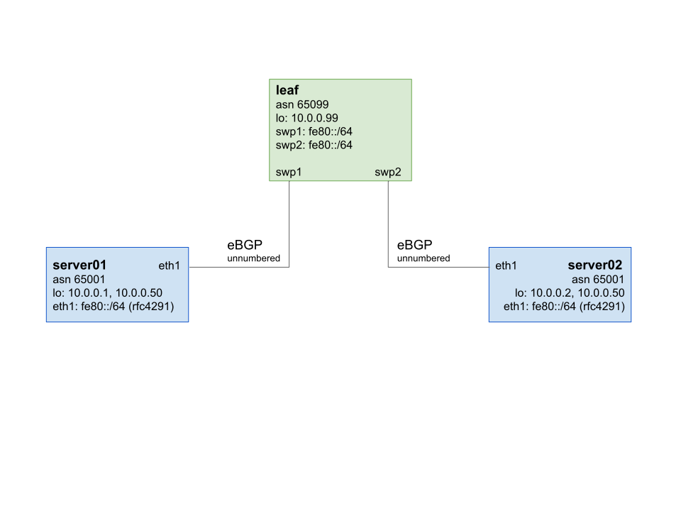

# ECMP-Demo

This project sets up Equal-Cost-Multipathing (ECMP) with an AnyCast ip address. The demo is based on Vagrant machines with Cumulus Linux on the leaf switch and two connected servers.

Also contained in the demo:

* eBGP unnumbered
* L3 only networking between switch and servers
* Routing on the Host (ROH) with Free Range Routing

## Requirements

* Vagrant >= 2.0.2
* Libvirt Plugin: `vagrant plugin install libvirt`

## Network Topology



## Usage

Run `vagrant up`.

Connect to the leaf switch with `vagrant ssh leaf`.  The server ip addresses `10.0.0.1`, `10.0.0.2` and `10.0.0.50` should be reachable from there.

The routing table on the leaf switch contains two destinations for `10.0.0.50` (see `net show route`).

Add a route from your pc to the leaf vm for the AnyCast address `10.0.0.50`:

```bash
ip route add 10.0.0.50/32 via 10.255.1.<leaf>
```

Test with curl from your pc; you should randomly get a response `A` or `B`:

```bash
curl http://10.0.0.50:8080
```
